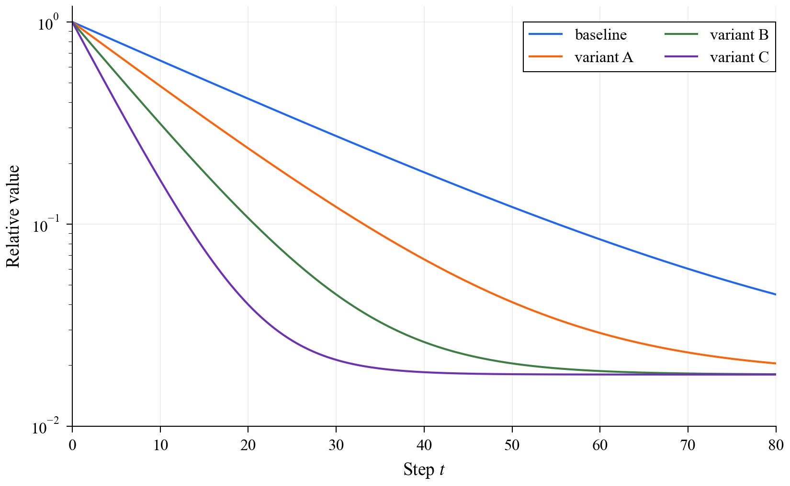
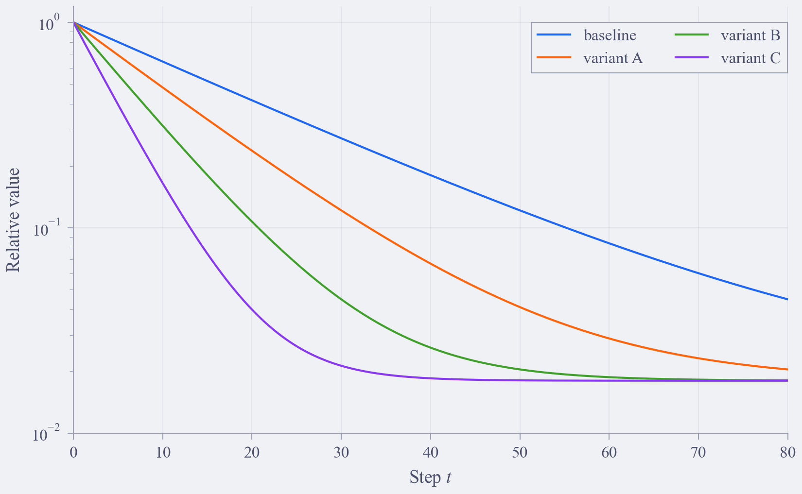
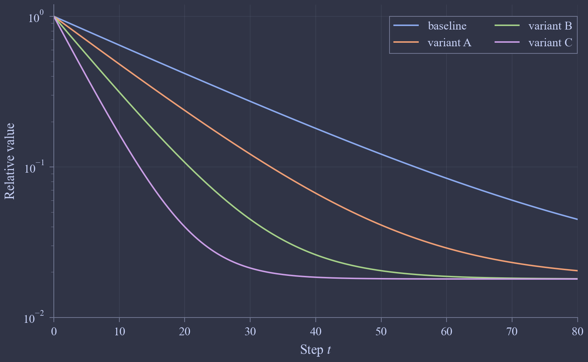
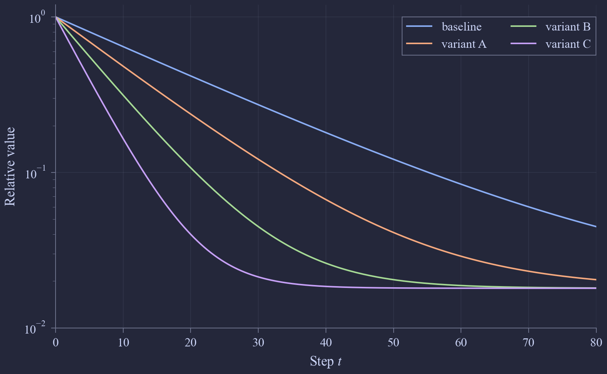
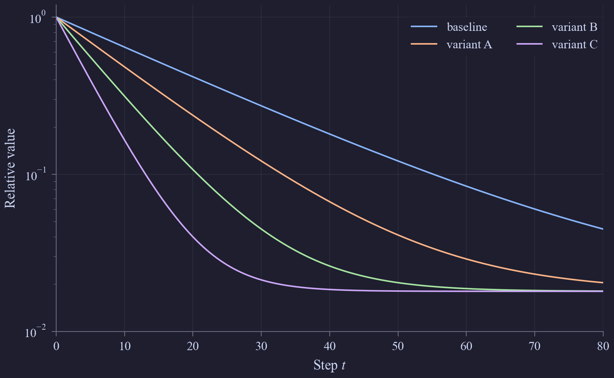
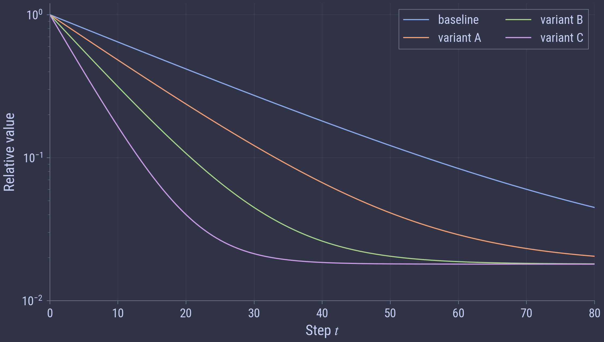

# figmint

`figmint` is my Matplotlib and PGFPlots style collection. I use it to create
plots for papers, talks, and meetings.

The Python package owns Matplotlib styles. The TeX package owns PGFPlots
styles and installs as `figmint.sty`.

Install the TeX package into your user TeX tree from the repository root:

```sh
l3build install
```

Check that TeX can find the installed package:

```sh
kpsewhich figmint.sty
```

## Preview

`normal`



`latte`



`frappe`



`macchiato`



`mocha`



`frappe` with overrides



## API

`figmint` deliberately has a small API, making it easy to grasp:

```python
from figmint import export_table, finish, register_fonts, style
```

and that's it.

The `style` function returns Matplotlib rcParams. `finish` is the post-plot helper for rendered-layout decisions that rcParams cannot make, currently grid-snapped legend placement. `register_fonts` is a convenience function to make Matplotlib aware of fonts installed on your computer. It is needed because Matplotlib is notoriously bad with font caches. My workflow is to try using all fonts directly (more on this below), and whenever this fails (you might see something like `findfont: Font family 'Roboto Condensed Light' not found.`), I register the font manually instead of refreshing Matplotlib's unreliable caches and praying.

`export_table` writes experiment results to tab-separated tables for PGFPlots.
Same-length one-dimensional columns are written directly:

```python
export_table("paper/data/loss.tsv", x=steps, y=mean, yerr=stderr)
export_table("paper/data/loss_ci.tsv", x=steps, y=mean, ymin=lower, ymax=upper)
```

For heatmaps, pass one two-dimensional value column plus one-dimensional `x` and
`y` coordinates. The value matrix has shape `(len(y), len(x))`:

```python
export_table("paper/data/heatmap.tsv", x=widths, y=depths, z=values)
```

The exporter writes data only. Plot type, axes, legends, colors, and layout stay
in LaTeX through PGFPlots and `figmint.sty`.

The API is designed to make it easy to switch between paper and talk/meeting plots. Paper plots are rigid: the background is always white and font families, font sizes, and figure sizes are determined by the conference's formatting instructions. Slides are completely different: one gets complete freedom to choose backgrounds, used font families, and aspect ratios that affect figure sizes, too. Copy-pasting paper plots into such slides just doesn't look right. But one also doesn't want to spend entire afternoons converting paper plots to match the slide styles. This is where the package comes in handy: switching between the supported themes, different fonts, or figure sizes takes seconds. It composes with slide themes and notation packages through the document that loads it.

```python
import matplotlib.pyplot as plt
from pathlib import Path
from figmint import finish, register_fonts, style

# Register fonts if Matplotlib doesn't see them
SLIDE_FONT_FILES = (
    Path.home() / "Library/Fonts/RobotoCondensed-VariableFont_wght.ttf",
    Path.home() / "Library/Fonts/RobotoCondensed-Italic-VariableFont_wght.ttf",
)
register_fonts(*SLIDE_FONT_FILES)


# Define a simple plotting function
def plot(path: Path) -> None:
    figure, axis = plt.subplots()

    xs = list(range(81))
    ys = [x**2 for x in xs]

    axis.plot(xs, ys)
    axis.set_xlabel(r"$x$")
    axis.set_ylabel(r"$f(x)$")
    axis.legend(loc="best")
    finish(axis)

    figure.savefig(path)
    plt.close(figure)


# Create paper plot
with plt.rc_context(style("normal", venue="icml", column="half")):
    plot(Path("figure_paper.pdf"))


# Create talk plot by only modifying the style
with plt.rc_context(
    style(
        theme="frappe",
        venue="icml",
        column="half",
        text_font="Roboto Condensed",
        font_weight="light",
        font_size=13.0,
        figure_size=(7.5, 4.25),
    )
):
    plot(Path("figure_talk.pdf"))
```

You can also apply a style globally:

```python
plt.rcParams.update(style("normal", venue="icml", column="half"))
```

## Themes

Supported themes are:

- `normal`
- `latte`
- `frappe`
- `macchiato`
- `mocha`

The TeX package exposes `FigmintWhite`, `FigmintBlack`, full Catppuccin color
names such as `FigmintFrappeBlue`, and figure role aliases such as
`FigmintFrappeBackground` and `FigmintFrappeCycleOne`. The `normal` theme also
exposes its repaired paper colors as `FigmintNormalBlue`,
`FigmintNormalPeach`, and so on.

`normal` uses a white background, black text, black edges, a repaired Catppuccin Latte categorical cycle, and Matplotlib's built-in `plasma` colormap for scalar data. Paper figures also use filled legend backgrounds and a low-alpha default grid. The normal categorical cycle keeps the Latte ordering and treats the cycle order as a priority list: earlier colors move only when the constraints force them to move, while later colors absorb more of the repair.

### Normal Color Cycle

The `normal` color cycle is a constrained repair of the Catppuccin Latte cycle for white-background academic figures. The Catppuccin Latte cycle is the starting point and the repaired cycle stays in the same order.

Let $p_i$ be the original Latte color at cycle index $i$ and $c_i$ be the repaired color at the same index. Colors live on the 8-bit sRGB grid, so each channel is an integer in $\{0,\ldots,255\}$. The first objective is to maximize the unchanged prefix length $k(c)=\max\{r:c_i=p_i\text{ for every }i<r\}$. Among palettes with maximal $k$, the second objective is lexicographic movement by cycle position: $$\operatorname{lexmin}_{c_0,\ldots,c_{n-1}}\left(\Delta E_{00}(c_k,p_k)^2,\Delta E_{00}(c_{k+1},p_{k+1})^2,\ldots,\Delta E_{00}(c_{n-1},p_{n-1})^2\right)$$

The constraints were:

- fixed ordering: color $c_i$ stays at Latte cycle position $i$;
- exact preservation when possible: $c_i=p_i$ unless moving it is needed for a constraint;
- white-background contrast: $C(c_i,\mathrm{white}) \ge 3.0$ for every repaired color, using WCAG relative-luminance contrast;
- categorical separation: $D(c_i,c_j) \ge 10$ for every distinct pair $i \neq j$.

The pairwise distance is the smallest CIEDE2000 distance over normal vision and three simulated color-vision modes: $$D(c_i,c_j)=\min_{m \in \{\mathrm{normal},\mathrm{protan},\mathrm{deutan},\mathrm{tritan}\}}\Delta E_{00}(S_m(c_i),S_m(c_j))$$

Here $S_m$ is the identity transform for normal vision and a severity-100 linear-RGB color-vision simulation for the other modes, clipped back into displayable sRGB before converting to CIELAB. The threshold $10$ is the default categorical color-blind-friendly `min_dist` bar used by `cols4all`.

The objective encodes the usual use pattern of a color cycle. The first few colors appear most often, so they get first claim on staying close to Catppuccin Latte. Later colors are still constrained by contrast and color-vision separation, but they are allowed to move more when that protects earlier entries.

The one-time computation used the constraints above as an 8-bit sRGB constrained search and ranked feasible candidates by the objective above. The original `peach` fails the white-background contrast threshold, so the longest feasible unchanged prefix is one color. The shipped `normal` cycle keeps `blue` exactly, repairs `peach` first, and lets later entries carry the remaining pairwise-separation requirements. The test suite verifies the constraints above and checks the unchanged-prefix bound.

Grayscale separation is deliberately excluded from the constraints. The target medium is digital color academic figures, and in 2026 that is the main reading path. A grayscale constraint forces the palette to spend contrast budget on luminance ordering, which fights the color-vision constraints and makes the colors worse for the actual default use case. For black-and-white output, the right mechanism is redundant encoding: markers, line styles, hatches, direct labels, or separate figure variants.

The separation criterion follows the categorical `min_dist` check in [`cols4all`](https://cols4all.github.io/cols4all-R/articles/01_paper.html). The white-background contrast constraint follows the [WCAG non-text contrast](https://www.w3.org/WAI/WCAG22/Understanding/non-text-contrast.html) threshold for graphical objects. The broader goals follow scientific-colormap guidance from [Crameri et al.](https://www.nature.com/articles/s41467-020-19160-7): perceptual separation, color-vision robustness, and readable scientific figures.

The formal repair above applies only to `normal`. The Catppuccin colors used by the themed styles are official palette values. Each themed style sets the line/bar color cycle from that theme and uses Matplotlib's built-in `plasma` colormap for scalar data. Dark themes set the axes, figure, and saved-output background to the theme base color, so exported plots can be imported into matching slide decks without a white rectangle.

## Venue Presets

Venue presets set the default figure size, font size, and native Matplotlib text font for paper figures. Figure text size is derived from the target venue's caption font size, so labels, titles, ticks, and legends share the caption scale at the final inserted figure size. ICLR and NeurIPS use `10 pt`; ICML uses `9 pt`. All supported venue presets use Times-style text. `text_font`, `font_weight`, `font_size`, and `figure_size` are overrides; omit them to use the venue preset. To make a talk version, change the theme and override the font and size fields when needed. If Matplotlib cannot already see the target font, call `register_fonts(...)` once before rendering.

Choose one of:

- `venue="iclr"`
- `venue="neurips"`
- `venue="icml"`

ICML supports `column="half"` and `column="full"`. ICLR and NeurIPS use `column="full"`.

Minimal calls:

```python
style("normal", venue="icml", column="half")
style(
    "frappe",
    venue="icml",
    column="half",
    text_font="Roboto Condensed",
    font_weight="light",
    font_size=13.0,
    figure_size=(7.5, 4.25),
)
style("normal", venue="icml", backend="pgf")
```

## Customization

`style(...)` accepts:

- `theme`
- `venue`
- `column`
- `width_fraction`
- `rows`
- `cols`
- `backend`
- `tex_compiler`
- `pgf_preamble`
- `text_font`
- `math_font`
- `font_weight`
- `font_size`
- `figure_size`
- `line_width`
- `grid_alpha`
- `height_to_width_ratio`

`backend="matplotlib"` uses native Matplotlib text and Mathtext. `text_font=None` uses the venue text font; the supported venues use Times-style text. `math_font="stix"` selects STIX Mathtext for native Matplotlib output.

`backend="pgf"` returns PGF backend rcParams with `tex_compiler="pdflatex"` by default. `pgf_preamble=None` makes figmint build the PGF preamble. `text_font=None` injects the venue text setup from the actual venue style file: ICLR and ICML use `times`; NeurIPS sets `\rmdefault` to `ptm` and `\sfdefault` to `phv`. Custom `text_font` values require XeLaTeX or LuaLaTeX and inject `fontspec` plus `\setmainfont`. `math_font=None` leaves LaTeX math at the compiler default. `math_font="stix"` injects `stix2` for pdfLaTeX and `unicode-math` with `STIX Two Math` for XeLaTeX and LuaLaTeX. A non-`None` `pgf_preamble` is used as the full manual preamble, so text and math font setup belong to that string.

`style(...)` is a pure rcParams builder. It does not call `matplotlib.use(...)`, `plt.switch_backend(...)`, or `savefig(...)`. In normal scripts with one output backend, import `matplotlib.pyplot` at the top, enter `plt.rc_context(style(..., backend="pgf"))`, create the figure inside that block, and call `savefig(...)` without a backend argument. That works because pyplot selects the backend at the first plotting call. Scripts that intentionally mix PGF and native Matplotlib output in one process should use Matplotlib's own backend API at the switch point.

`finish(axis)` is called after the plot and legend exist, before `savefig(...)`. For a fixed legend location such as `loc="upper right"`, it lets Matplotlib place the legend, then snaps the legend anchor to the nearest major grid coordinate that keeps the legend inside the axes. For `loc="best"`, it searches fixed legend locations and all column counts from one to the number of legend entries, scores each rendered candidate by data overlap and compactness, and snaps the selected candidate to the same major-grid coordinates.

## Tests

Run the Python tests:

```sh
make test
```

Run the TeX tests:

```sh
l3build check
```

## License

Apache 2.0.
